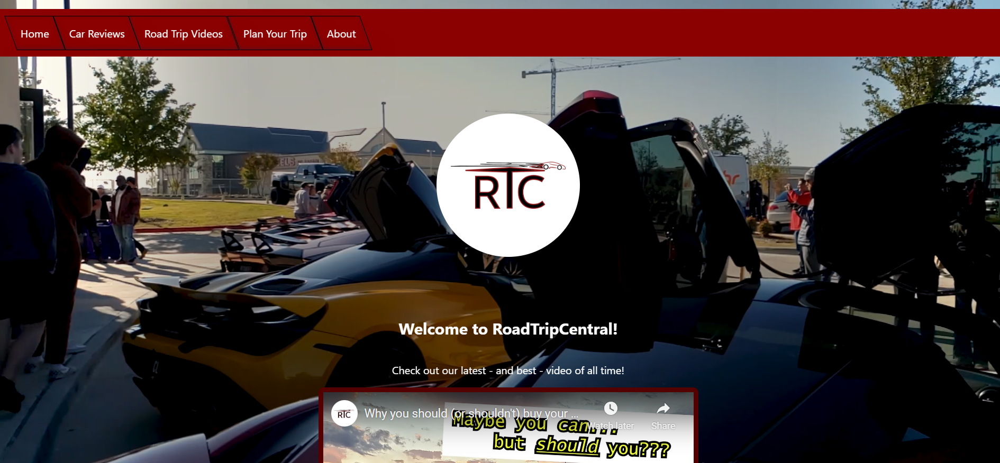
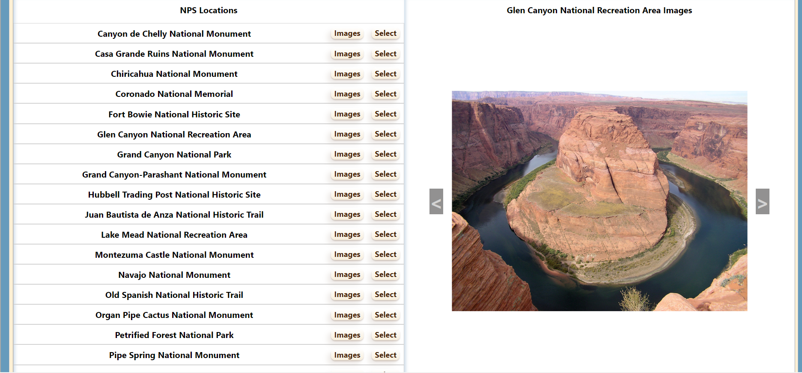
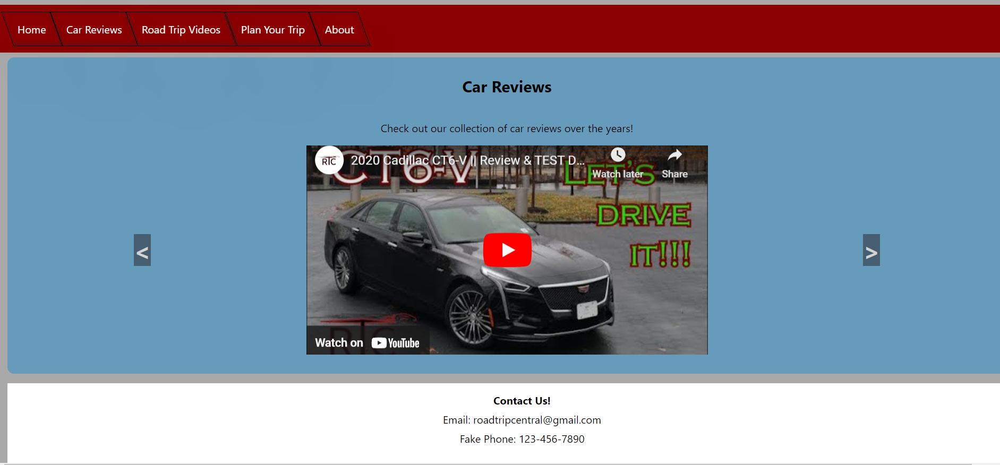

README

RoadTripCentral (Website) 
This is a webpage that highlights video content featuring exciting automobiles and fantastic scenery. Sit back and enjoy the creative/entertaining content or use the built-in National Park Service interface to learn more about what the wild U.S. has to offer.

Link 
Check out the website here!----> 

Motivation 
I have had a slightly unhealthy obsession with cars since a young age, and over the years that lead me to creating automotive video content that I've shared with the world via Instagram, Facebook, and YouTube. I have always wanted to make a website for this venture (dubbed RoadTripCentral), and I've finally taken the time to make it happen!

Screenshots 

 
Features 
The newest features for this site (aside from implementing a back end with Express and Mongoose) include a authorization page that only allows logged-in users to submit new content requests to the site.

Installation 
Visit the GitHub repository at https://github.com/caution73/rtc-website-mern.git, where you can fork the code and/or download the code to your own computer. You will need to create a .env file and include a SECRET (for JWT), a database URL, and an api key for the National Park Service (obtainable for free from the NPS website).

Contribute 
If you would like to contribute to the development of this project, I would be thrilled to improve the styling throughout, as well as further develop the NPS page by creating additional search fields for users to obtain other useful information from the API.

Trello Board 
Here's a link to the associated Trello board, which includes to-do lists and wireframes: https://trello.com/b/Rjhssfia/rtc-mern.

Unresolved Problems 
The overall functionality is present, but I would love to make drastic improvements to functionality as well as styling. The main issues I am currently dealing with involve the information table that pops up once the user selects a NPS location in the NPS page. There are several fields that are difficult to populate due to the data structure of the API information. Some CSS issues that I'm working on resolving involve making sure that the page has an adequately responsive design (no overflowing content, create break points, etc.)  New issues involve styling and user-experience involving the Auth page (I want it to "redirect" to another page once logged in/out") and the Requests page (I want to add full CRUD functionality.)

Stretch Goals 
Aspirational improvements for the page include:

Changing the background video (on Home page) to be sourced from the RoadTripCentral YouTube page.
Expanding the usability of the NPS interface to include additional search fields as well as more conveniently displayed information.
Adding addional images and videos from the RoadTripCentral social media profiles.
Refactoring the code to be more efficient and easy-to-read.
Developing the About page.
Creating an additional page to present RoadTripCentral video pricing options.
Creating comment sections or other ways for users to interact with RoadTripCentral/others.
Include a "favorite" button for either videos or NPS locations that allows a user to save their favorite content.
Providing full CRUD functionality for the Requests page.

Credits 
I'd like to thank all those that have helped me debug and test the website (special shout out to Anthony and Annson), as well as those that have taken the time to view the website. I hope that my content has provided you with a memorable experience...and if it hasn't yet, come back to try it later. It will only be improving!# RoadTripCentral-site
